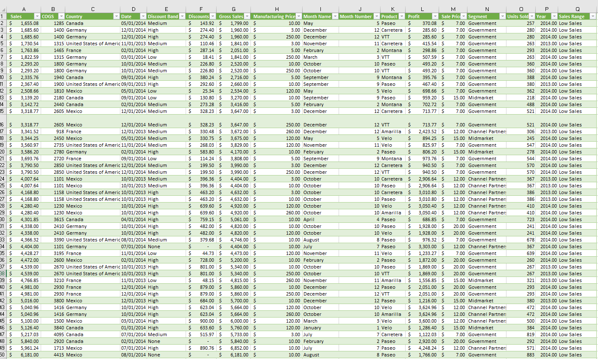
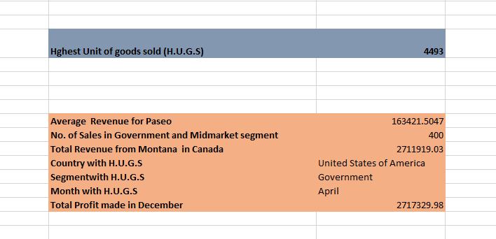

# Sales-Report
Sales Data Analysis Report

## Introduction

A hypothetical sales dataset with about 700 rows and 15 columns will be examined in order to get insightful knowledge. The training included a dataset that gave me the chance to practice my data analysis skills. I'll also compute certain metrics, examine the data, and draw findings and suggestions.

_**Disclaimer**_ ⚠️- _All data used for this analysis are hypothetical data generated and do not represent any company's data or an attempt to endanger their performance._

## Sales Dataset of "OTIzzz Company"-
The task here inludes to Calculate the following:
1. Average revenue generated from each sale of 'Paseo'
2. Number of sales made in the Government and Midmarket segment
3. Total revenue generated from the sales of 'Montana' in Canada
4. The Country, Segment and Month was the highest unit of goods sold
5. Total profit made in December?

## Problem Statement for TASK_TWO

The primary goal of the analysis is to draw insightful conclusions from the sales data, including the average revenue for "Paseo," the volume of sales in the "Government" and "Midmarket" segments, the total revenue from "Montana" sales in Canada, the highest unit of goods sold in a given region, segment, and month, and the total profit in December.

## Skill and Concept Demonstrated:

The analysis had demonstrated a range of essential data analysis skills, such as:
- Data extraction
- Manipulation, and Visualization
- Statistical measures and conditional logic to make data-driven decisions.
- Excel functions (e.g., XLOOKUP, SUMPRODUCT)

## Visualization
To calculate the average revenue generated from each sale of 'Paseo,' I used the **AVERAGEIF** function in Excel. Additionally, to find the number of sales in the 'Government' and 'Midmarket' segments, I employed the **SUMPRODUCT** function. Moreover, to determine the total revenue from the sales of 'Montana' in Canada, I utilized **SUMIFS**. Furthermore, for identifying the highest unit of goods sold, I used the **MAX** function at first and then I used the **XLOOKUP** function to locate the country, segment and month with the highest unit sold . You can refer to the attached Excel files for more details and the visual representation of this data is presented below:

## Conclusions and Recommendations

Based on our analysis:

- 'Paseo' generates an average revenue of **$163,422** per sale. Consider optimizing sales strategies for 'Paseo' to increase revenue further.
- 'Government' and 'Midmarket' segments account for a total of **400** sales. Focus on these segments to generate more sales which can lead to potential growth opportunities.
- 'Montana' sales in Canada have contributed **$2,711,919** in revenue. We can explore methods to enhance the performance of 'Montana' products.
- **'United State of America'** country, **'Government'** segment, as well as the month **'Apiril'** had the highest unit of goods sold. We can Investigate what factors led to this exceptional performance and consider to apply thesame strategy to the least unit of goods sold and where sales ar abysmally poor.
-   Lastly, we realized a total profit of **2,717,330** in the month of December; consider using such tactics in other situations after analyzing the factors that led to this month's high profits.

  
This analysis provides actionable insights to optimize sales strategies and improve revenue. Further investigations and implementation of the recommendations can lead to better business outcomes.

